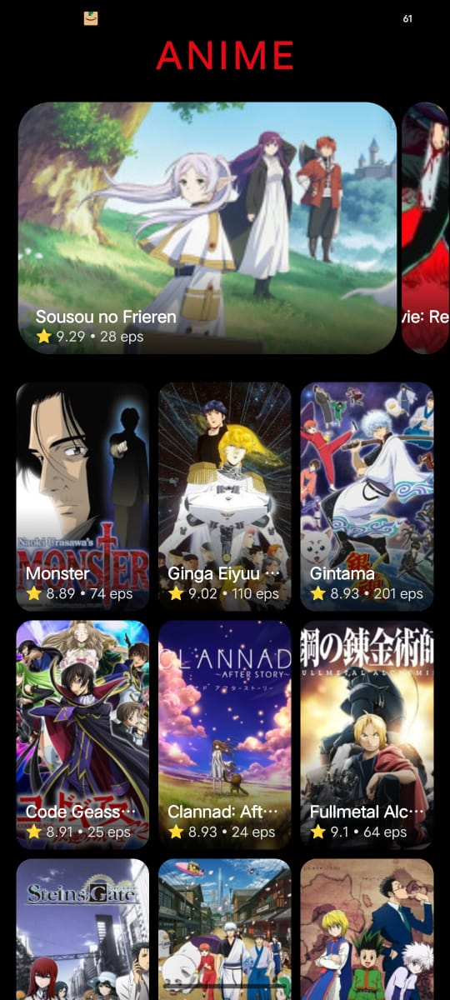
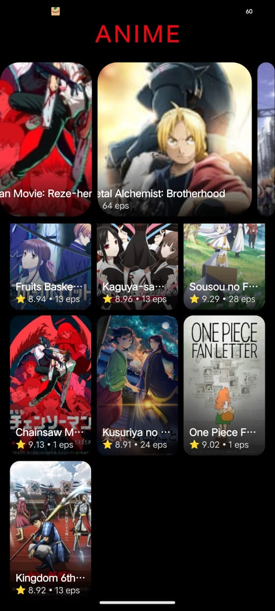
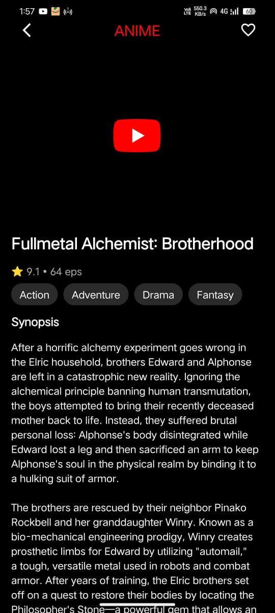
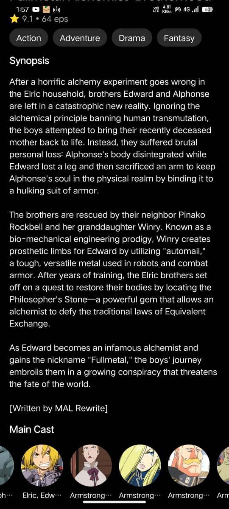
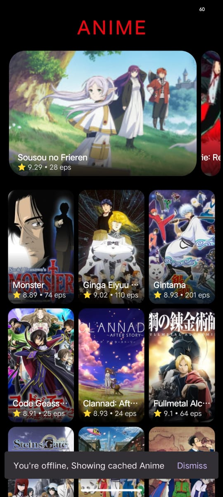
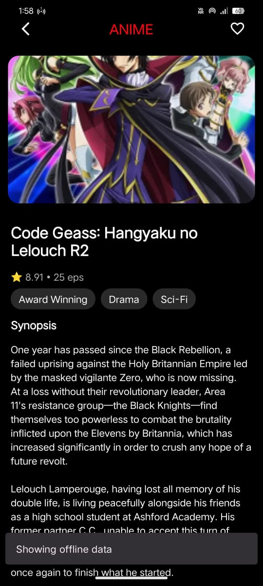
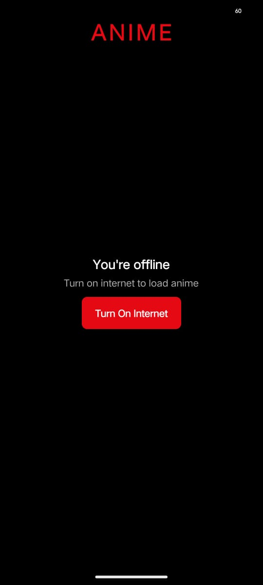
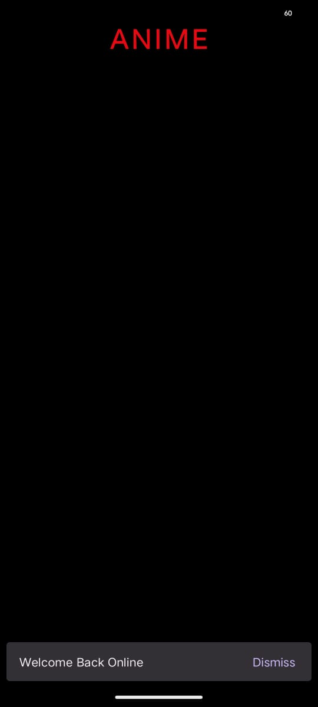

# Seekho Anime Application

An Android application that fetches and displays anime series using the **Jikan API**, supports **offline mode**, and follows **clean MVVM architecture** with a Netflix-inspired UI.

---

## Overview

This app allows users to:
- Browse top-rated anime
- View detailed information including synopsis, genres, cast, and trailer
- Access previously loaded content **offline**
- Experience a clean, intuitive, Netflix-like UI

The project emphasizes **robustness**, **offline-first behavior**, and **clean architecture**.

---

## Features

### 1️ Anime List (Home Screen)
- Fetches top anime from Jikan API
- Displays:
  - Poster image
  - Title
  - Rating (MyAnimeList score)
  - Number of episodes
- UI structure:
  - **Top Carousel** (top-rated anime)
  - **3-column Grid** (full list)
- Auto-refresh when network reconnects

**API Used**

``` https://api.jikan.moe/v4/top/anime ```

---

### 2️ Anime Detail Screen
When an anime is selected:
- Shows:
  - Trailer video (YouTube) if available
  - Poster image fallback if trailer unavailable/offline
  - Title
  - Rating & episode count
  - Synopsis
  - Genres
  - Main cast (horizontal list)
- Netflix-style UI with rounded video corners

**APIs Used**

``` https://api.jikan.moe/v4/anime/{anime_id} ```

``` https://api.jikan.moe/v4/anime/{anime_id}/characters ```


---

### 3️ Offline Support (Room Database)
- Anime list and detail data are cached locally using **Room**
- App works without internet:
  - Shows cached anime list
  - Shows cached detail screen
  - Disables trailer playback offline
- Automatically syncs fresh data when internet is restored

---

### 4️ Network Awareness & Sync
- Real-time network monitoring using `ConnectivityManager`
- Differentiates:
  - **Offline with cached data**
  - **Offline without cached data**
- UX behavior:
  - Snackbar when offline but cache exists
  - Full-screen offline empty state when no cache
  - Auto refresh when back online

---

### 5️ Error Handling
Gracefully handles:
- API failures
- Network loss
- Empty or null API fields
- Database access issues

UI never crashes due to missing data; unavailable sections are hidden dynamically.

---

##  Architecture & Design

### MVVM Architecture
The app follows **Model–View–ViewModel (MVVM)**:

```
UI (Activity)
↓ observes

ViewModel
↓ calls

Repository
↓ decides

API / Room DB
```


### Why MVVM?
- Clear separation of concerns
- Testable and maintainable
- UI remains reactive to data changes

---

##  Tech Stack & Libraries

| Purpose | Library |
|------|------|
| Language | Kotlin |
| Architecture | MVVM |
| Dependency Injection | Hilt |
| Networking | Retrofit |
| Image Loading | Glide |
| Local Database | Room |
| Reactive State | StateFlow |
| Video Playback | Android YouTube Player |
| UI | Material Components |

---

##  Key Design Decisions

###  Separate APIs for Detail & Cast
- Anime details and characters come from different endpoints
- Repository merges data for UI
- Improves reliability and avoids null data issues

###  Offline-First Approach
- Repository always tries network first
- Falls back to Room DB automatically
- UI adapts based on data source (network vs cache)

###  Trailer Handling
- YouTube ID extracted safely from:
  - `youtube_id`
  - or fallback `trailer.url`
- Trailer disabled gracefully when offline

###  Defensive UI
- Missing fields (cast, trailer, synopsis) do not break UI
- Sections hide automatically if data is unavailable

---

## Legal / Design Constraint Handling

**Scenario:** Profile images cannot be shown due to a legal change

- Image views can be toggled off without breaking layout
- Text-only fallback maintains UI integrity
- Demonstrates adaptability to external constraints

---

## Screenshots

### Splash Screen


### Home Screen
<p align="left">


</p>

### Anime Detail Screen
<p align="left">


</p>

### Offline – Cached Data Available
<p align="left">


</p>

### Offline – No Cached Data


### Back Online


## App Demo Video

[Click here to watch the app demo video](screenshots/demo_video.mp4)


##  Edge Cases Handled

- App launched for the first time with no internet connection
- API returns partial or null data fields
- Trailer unavailable for certain anime
- Characters API fails or returns empty data
- Network connectivity toggles during app usage

---

##  How to Run

1. Clone the repository
2. Open the project in **Android Studio**
3. Sync Gradle files
4. Run the app on an emulator or physical device (Android 8.0+)

---

##  Notes

- Jikan API responses may vary between anime; the app handles inconsistencies gracefully
- Designed with scalability and real-world robustness in mind

---

### Release Build
* If you want to test this App, You can Find Release build for this project in release folder.

---

##  Author

**Ravivarma**  
Android Developer
